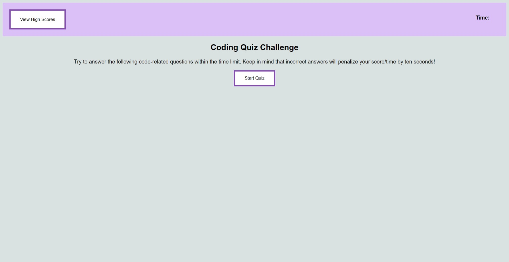
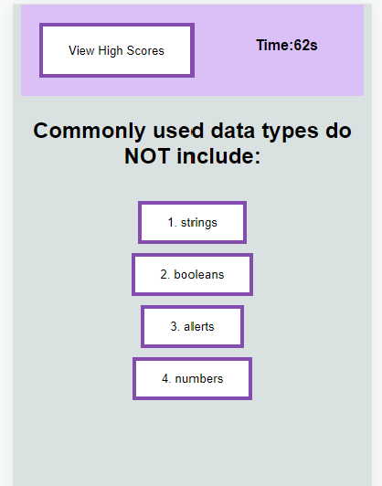

# Coding Quiz

## Description

This Coding Quiz webpage is a series of multiple-choice questions realted to Java Script. The coding assement will alot 75 seconds for the user to comlete the quiz.
 *This coding quiz should be used to asses the knowledge of a coder* 
* The coding asessment is timed and will alot 75 seconds for the user to complete. 
    * The timer will being whtn the Start Quiz button is clicked.

* A question is answered by selcting one of the buttons from the multiple choice answers.
    * The user will be presented with an alert on the DOM indicting if their question response was "Correct" or "Wrong".

    * When a question is awered correctly the timer will continue to count down by the seconds.

    * When a question is answered incorrectly 10 seconds is automatically subtractd from the timer and then the timer will continue to count down by the seconds. 

* The quiz has ended when the timer hits 0 or all questions are answered.

* Your final score will display immediatley when the quiz has ended and will reflect the total time left in the quiz.
    * You will be prompted to enter your initials to document your score. 

* Click the Go Back button to take the quiz again or clear scores from the scoreboard.

* A View High Scores button resides in the Header which can be clicked to view all Scores saved to the local storage. 
    * Scores will be listed from highest to lowest.

## Access
<!-- Deployed weblink-->

The Coding Quiz webpage can be accessed at the following URL... 

The URL of the GitHub repository ...

https://github.com/lynnadelesadler/Code-Quiz

## Visuals
<!-- Provide the visuals for full display and phone display -->
This is how the deployed coding quiz website will look on a full display computer screen.

This is how the deployed coding quiz website will look on a cell phone display. 

## Usage
<!-- Provide a list of steps on how to use the coding quiz -->
The quiz will begin when the Start Quiz button is selected starting the timer and prompting the user with the first question.  

*Here you will see a demontration on how the coding quiz webpage works* 

* The coding asessment is timed and will alot 75 seconds for the user to complete. 
    * The timer will being whtn the Start Quiz button is clicked.

* A question is answered by selcting one of the buttons from the multiple choice answers.
    * The user will be presented with an alert on the DOM indicting if their question response was "Correct" or "Wrong".

    * When a question is awered correctly the timer will continue to count down by the seconds.

    * When a question is answered incorrectly 10 seconds is automatically subtractd from the timer and then the timer will continue to count down by the seconds. 

* The quiz has ended when the timer hits 0 or all questions are answered.

* Your final score will display immediatley when the quiz has ended and will reflect the total time left in the quiz.
    * You will be prompted to enter your initials to document your score. 

* Click the Go Back button to take the quiz again or clear scores from the scoreboard.

* A View High Scores button resides in the Header which can be clicked to view all Scores saved to the local storage. 
    * Scores will be listed from highest to lowest.

 
## Support
For help with this webpage please contact 
|Name       | Email                     |
|-----------|---------------------------|
|Lynn Sadler| lynnadelesadler@yahoo.com |

## Roadmap
Check back to this page as enhacements could be made for usability and optimized display.

Development WIP to ensure the score intials input only allows alaphabetic text.

## Authors and acknowledgment

Sourcecode credit to be given to Lynn Sadler. 

Acknowledgement to Uconn Full Stack Web Developer bootcamp for suppoting me on my developer journey!

Coding quiz acceptance criteria credit to be given to © 2022 Trilogy Education Services, LLC, a 2U, Inc. brand. 

## License

N/A
